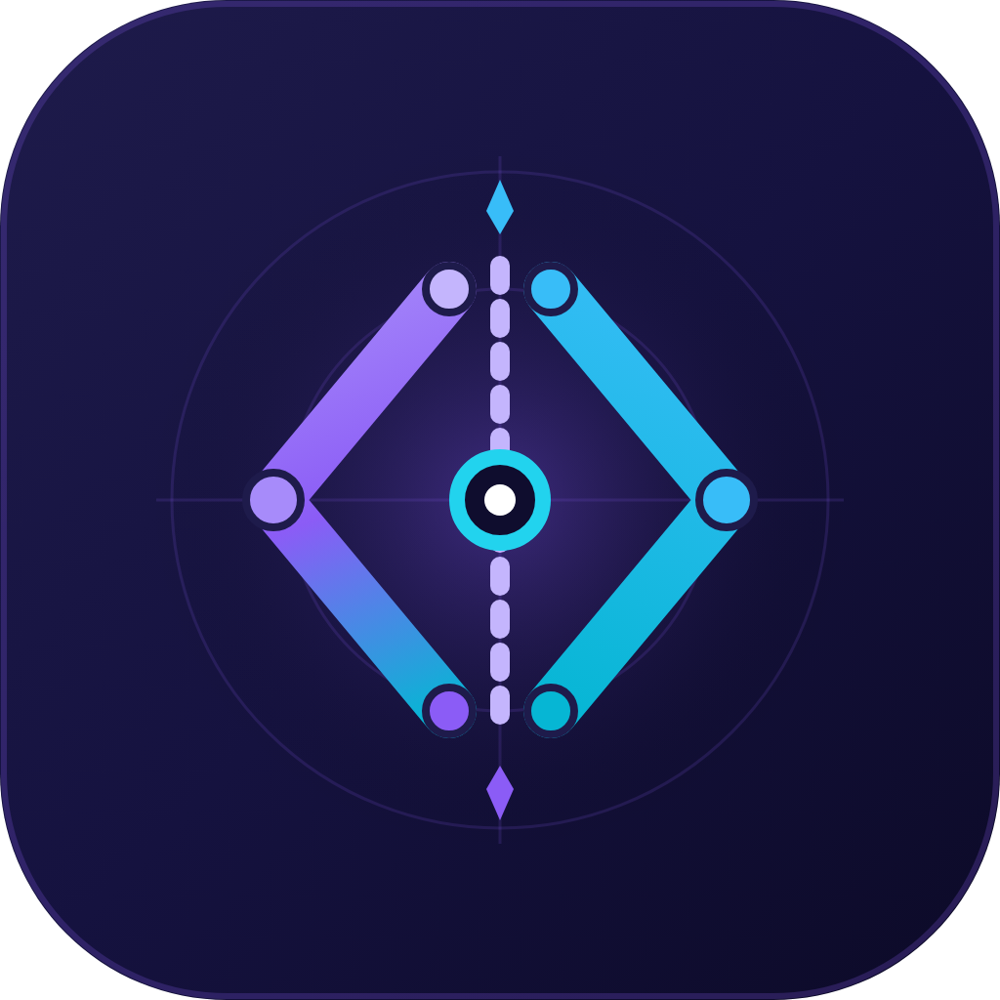
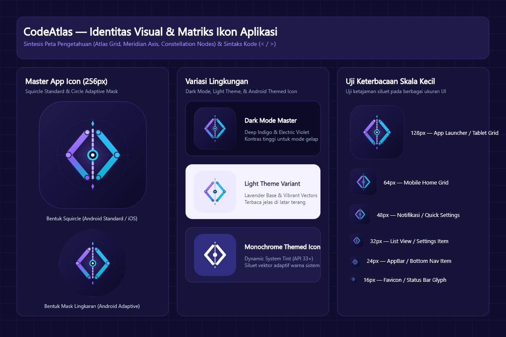

<p align="center">
  
</p>

<h1 align="center">CodeAtlas</h1>

<p align="center">
  <b>Ensiklopedia Interaktif Fundamental Pemrograman & Peta Ekosistem Rekayasa Perangkat Lunak</b><br>
  <i>Aplikasi Mobile Offline-First (Flutter) Berbahasa Indonesia untuk Pemula dan Vibecoder</i>
</p>

---

## 🎨 Identitas Visual & Ikon Aplikasi

CodeAtlas menggunakan identitas visual berbasis filosofi **Deep Tech Synth**:
- **Sintesis Simbol**: Menggabungkan kisi kartografi / sumbu meridian atlas pengetahuan (*constellation nodes*) dengan kurung siku kode (`< / >`).
- **Palet Warna**: *Deep Space Midnight Indigo* (`#1E1B4B`), *Electric Violet* (`#8B5CF6`), *Luminous Lavender* (`#A78BFA`), dan *Hyper Cyan* (`#06B6D4`).
- **Dukungan Adaptif**: Dilengkapi ikon launcher adaptif Android (foreground terpisah dan background aman), ikon bulat legacy, serta *Monochrome Themed Icon* untuk Android 13+.
- **Aset Vektor & Master**: Berkas master SVG dan PNG resolusi tinggi tersedia di `assets/branding/`.

<p align="center">
  
</p>

---

## ✨ Fitur Utama

1. **Beranda (Home)**
   - Status pembelajaran per lapis (Fundamental & Ekosistem) secara *real-time*.
   - Tombol cepat **Mulai dari nol** dan **Pilih tujuan**.
   - Kartu **Lanjutkan Membaca** yang mengarahkan langsung ke topik terakhir yang dibuka.
   - Status pemahaman mandiri: **Belum**, **Sedang**, dan **Paham**.

2. **Jelajah (Explore)**
   - Tampilan dua tab terpisah: **Fundamental Programming** (47 topik dalam 12 kelompok) dan **Dunia & Ekosistem** (52 domain dalam 12 kelompok industri).
   - Mesin pencarian teks cerdas mencakup judul, ringkasan, penjelasan awam/teknis, kata kunci (*keywords*), dan skenario *vibecoding*.
   - Filter gabungan (*AND*): Lapis, Kategori, dan Tingkat Kesulitan (*Pemula*, *Menengah*, *Lanjutan*).

3. **Detail Topik (Topic Reader)**
   - **Pedagogi Analogi Keseharian**: Dibuka dengan analogi awam konkret sebelum masuk ke istilah teknis.
   - **Penjelasan Teknis Akurat**: Definisi industri, perilaku kompilasi/runtime, dan jebakan umum (*common pitfalls*).
   - **Contoh Kode Statis**: Snippet 3–15 baris dengan label bahasa, penjelasan baca, dan *"Hasil yang diharapkan"*.
   - **Kenapa Penting saat Vibecoding**: Skenario nyata saat menerima kode dari AI, risiko kekeliruan, dan hal yang perlu ditanyakan/diverifikasi ke AI.
   - **Prasyarat & Topik Terkait**: Navigasi keterhubungan antar-konsep tanpa siklus (*Directed Acyclic Graph*).
   - **Catatan Pribadi**: Editor catatan dengan batas 20.000 karakter, indikator status simpan, dan dialog konfirmasi perubahan belum tersimpan.

4. **Peta Prasyarat (Interactive Roadmap)**
   - Visualisasi graf terarah (*DAG*) hubungan prasyarat antar-topik menggunakan `InteractiveViewer` dengan kemampuan *pan* dan *zoom*.
   - Filter fokus per lapis, kategori, atau jalur belajar.
   - Tampilan alternatif daftar relasi teks yang setara untuk aksesibilitas (*screen reader / TalkBack / VoiceOver*).

5. **Latihan (Practice)**
   - **Kuis Tebak Bahasa**: Membaca dan mengenali bahasa pemrograman dari ciri sintaks tanpa bocoran metadata bahasa sebelum dijawab.
   - **Kuis Tebak Konsep**: Menguji pemahaman konsep logika, arsitektur, dan keamanan dari cuplikan kode.
   - **Perbandingan Sintaks Multi-Bahasa**: Menampilkan konsep identik (variabel, operator, percabangan, loop, fungsi, list, class, error handling, async) berdampingan dalam **Dart**, **TypeScript**, dan **Python**.

6. **Jalur Belajar (Learning Paths)**
   - Preset jalur siap pakai:
     - *Memahami dasar dari nol* (`general`)
     - *Membaca kode Flutter* (`flutter`)
     - *Memahami web* (`web`)
     - *Memahami backend* (`backend`)
     - *Memahami data* (`data`)
   - Otomatis melengkapi prasyarat transitif (*transitive closure*) dan mengurutkan secara topologis (*Topological Sort*).
   - Pembuat jalur kustom (*custom path*) dengan validasi urutan dan pencegahan penghapusan topik prasyarat.

---

## 📊 Cakupan Konten (Production Dataset v2)

- **Total Kategori**: **76**
  - 12 Kelompok Fundamental (*group*)
  - 12 Kelompok Ekosistem (*group*)
  - 52 Domain Ekosistem (*domain*)
- **Total Artikel Topik**: **99 Artikel Lengkap**
  - 47 Artikel Fundamental Programming
  - 52 Artikel Pengantar Domain Ekosistem
- **Total Soal Kuis**: **36 Soal**
  - 14 Kuis Tebak Bahasa
  - 22 Kuis Tebak Konsep
- **Kelompok Perbandingan Sintaks**: **10 Kelompok** (masing-masing tersedia dalam Dart, TypeScript, dan Python)

---

## 🛠️ Arsitektur & Teknologi

- **Framework**: Flutter 3.47+ (Dart 3.13+)
- **Desain UI**: Material 3, Dark/Light theme otomatis mengikuti sistem, tipografi responsif.
- **Penyimpanan Lokal**: SQLite via `sqflite` (skema DDL ketat dengan `PRAGMA foreign_keys = ON`).
- **Offline-First**: Seluruh konten dibundel di dalam aset `assets/content/content.json` dan di-seed saat pembukaan pertama.
- **Bebas Eksekusi Kode**: Tidak ada compiler, interpreter dinamis, atau sandbox yang mengeksekusi kode di perangkat pengguna demi keamanan dan kesederhanaan.

---

## 🚀 Menjalankan Proyek

### Prasyarat
- Flutter SDK 3.47+
- Android SDK / Java JDK (untuk build Android APK)

### Langkah Menjalankan
```bash
# 1. Pindah ke direktori aplikasi
cd codeatlas

# 2. Pasang dependensi paket
flutter pub get

# 3. Jalankan pengujian otomatis (Unit & Content Tests)
flutter test

# 4. Periksa kepatuhan kode dan static analysis
flutter analyze

# 5. Verifikasi format kode
dart format --output=none --set-exit-if-changed lib test

# 6. Kompilasi APK debug Android
flutter build apk --debug
```

Hasil kompilasi APK akan tersedia di:
`build/app/outputs/flutter-apk/app-debug.apk`

---

## 📁 Struktur Folder

```
codeatlas/
├── assets/
│   └── content/
│       └── content.json           # Dataset produksi 99 artikel, 76 kategori, 36 kuis
├── lib/
│   ├── main.dart                  # Titik awal, inisialisasi DB, seeding konten, UI error retry
│   ├── app.dart                   # MaterialApp, tema Material 3, navigasi bawah 5 tab
│   ├── data/
│   │   ├── models.dart            # Model data immutable & parsing JSON aman
│   │   ├── app_database.dart      # Inisialisasi SQLite, PRAGMA foreign keys, migrasi
│   │   ├── seed_loader.dart       # Validasi integritas JSON, atomic seeding & upgrade
│   │   ├── content_repository.dart# Kueri baca katalog, pencarian, relasi, perbandingan
│   │   └── learning_repository.dart# CRUD progress belajar, catatan, dan jalur kustom
│   ├── state/
│   │   └── app_state.dart         # ChangeNotifier pengelola state global aplikasi
│   ├── features/
│   │   ├── home/                  # Halaman Beranda & ringkasan progress
│   │   ├── explore/               # Halaman Jelajah, pencarian & filter multi-lapis
│   │   ├── topic/                 # Halaman Detail Topik & editor catatan
│   │   ├── roadmap/               # Halaman Peta Hubungan DAG & list aksesibel
│   │   ├── practice/              # Halaman Latihan, Kuis & Perbandingan Sintaks
│   │   └── learning_paths/        # Halaman Jalur Belajar, Preset & Editor urutan
│   └── widgets/
│       ├── code_snippet.dart      # Komponen penampil snippet kode dengan salin teks
│       └── topic_tile.dart        # Komponen kartu item topik yang dapat digunakan ulang
└── test/
    ├── bootstrap_and_retry_widget_test.dart # Fallback banner upgrade gagal, error & retry
    ├── comparison_widget_test.dart        # Auto-switch tata letak vertikal skala 200%
    ├── content_and_path_test.dart         # Validasi 99 artikel, 76 kategori, DAG, kuis
    ├── explore_filter_widget_test.dart    # Tab navigasi dan filter gabungan AND
    ├── learning_flow_test.dart            # Progress, batas catatan, kuis scoring, preset
    ├── learning_path_algorithm_test.dart  # Transitive closure, deduplikasi, topological sort
    ├── quiz_session_widget_test.dart      # Penyamaran label bahasa, stabilitas kuis
    ├── roadmap_filter_widget_test.dart    # Alur bertahap 3 tingkat Roadmap & jump prasyarat
    ├── topic_detail_widget_test.dart      # Artikel 8 bagian, FAB Daftar Isi, bebas overflow
    ├── topic_notes_widget_test.dart       # CRUD catatan, dirty indicator, in-flight typing
    └── version_branching_unit_test.dart   # Percabangan versi DB & migrasi SQLite v2
```

